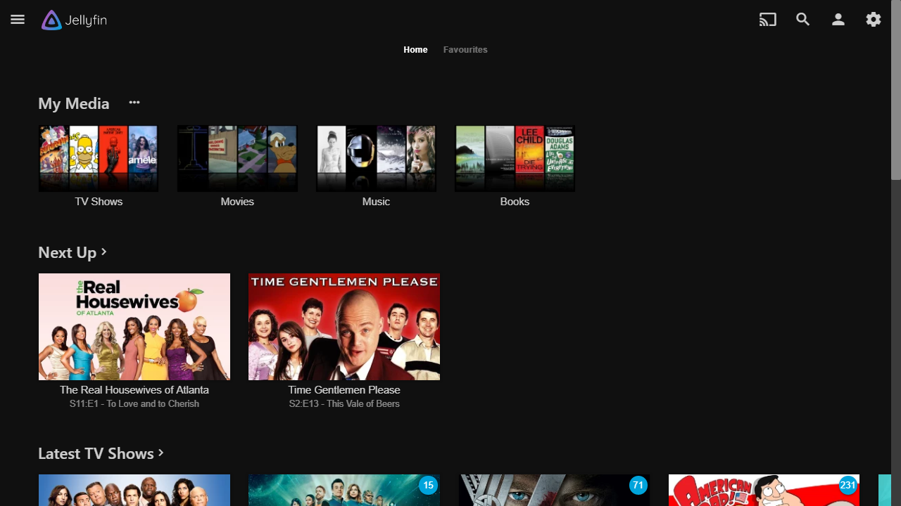
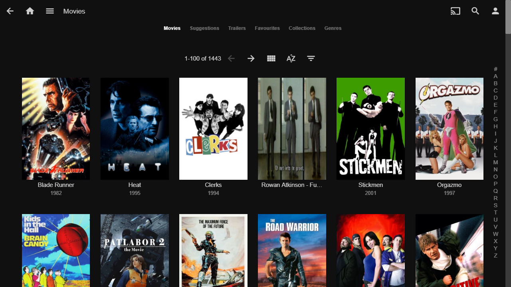
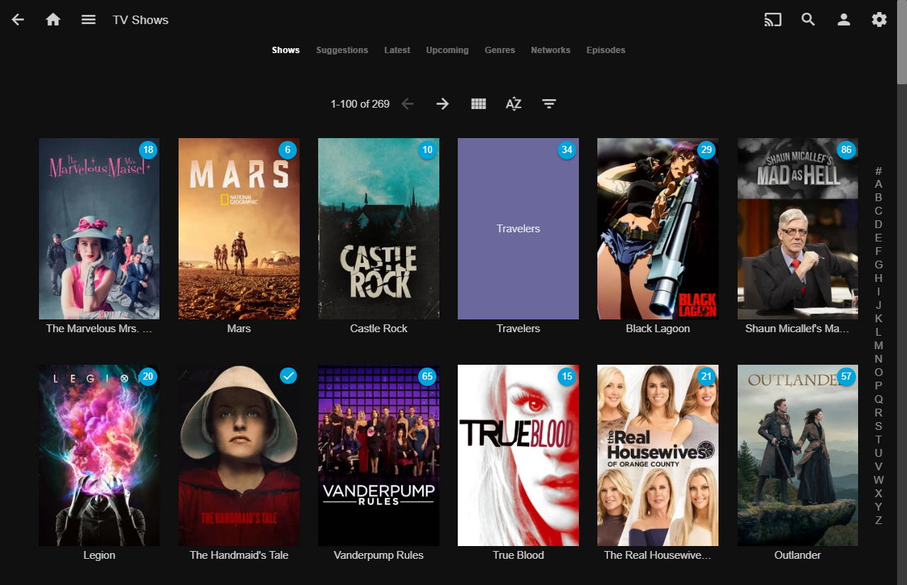
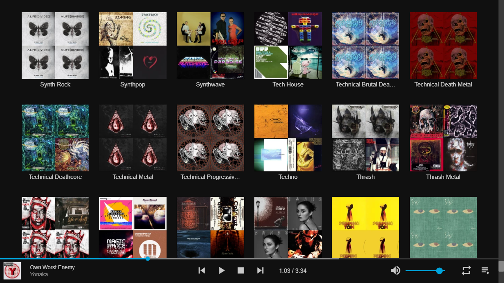

# Jellyfin Theater

Jellyfin Theater is a local client that connects to a Jellyfin server.

Currently the jellyfin-theater-electron connects using http protocol.



# Building

This application is implemented as an electron app and is built off of
a NodeJS code base. Because of this you will need to NodeJS runtime and
package manager. The following versions have been tested:

| Software Name | Version  |
| ------------- | -------- |
| Node JS       | 11.4.0 > |
| npm           | 6.4.1    |

## Getting Started Installing Jellyfin Theater

If you are looking to use the Jellyfin Theater you will need to start by downloading this repository via the git command, or by downloading a zip. you can do so by either

SSH

```
$ git clone git@github.com:jellyfin/jellyfin-theater-electron.git
```

HTTPS

```
$ git clone https://github.com/jellyfin/jellyfin-theater-electron.git
```

Note : If you dont have git installed you can allways download a zip by clicking the green clone or download button on the right and then clicking Download Zip

After downloading the source the source you will need to install the dependencies for the project. You can do so by typing into your terminal

```
$ cd jellyfin-theater-electron

$ yarn install
```

Once the installation has been finished you will need to run this command in the directory to activate the program.

```
$ npm start
```

## Jellyfin Theater Settings Location

At first launch, you will be asked to enter your server address. This parameter is kept in:

-   %APPDATA%/Jellyfin Theater on Windows
-   ~/.config/Jellyfin Theater on Linux
-   ~/Library/Application Support/Jellyfin Theater on macOS

## Building And Releasing Jellyfin

Start of building and releasing by commiting as usual, then you want to run these commands for the selected operating system.

Note :
If you are on ubuntu you may need to install additional dependencies

```
# apt-get -y install \
	libgtkextra-dev libgconf2-dev \
	libnss3 \
	libxss1 \
	libasound2 \
	libxtst-dev
```

#### Releasing For Windows

`$ yarn win`

#### Releasing For Linux

`$ yarn linux`

#### Releasing For Macintosh

`$ yarn mac`

## Screenshots







